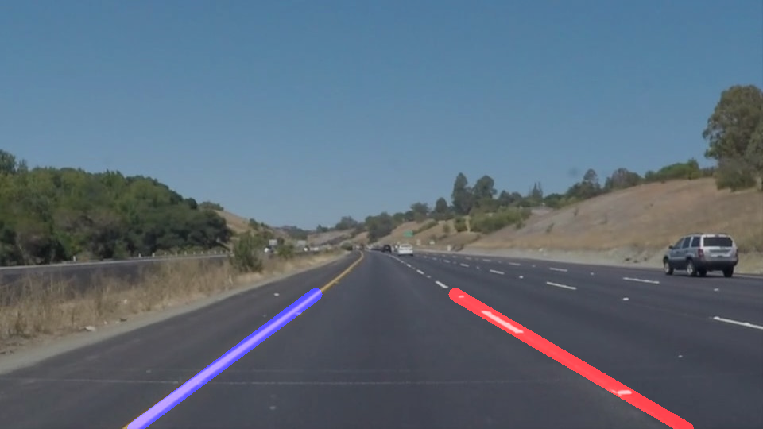

# **Finding Lane Lines on the Road**

### Reflection

### 1. Describe your pipeline. As part of the description, explain how you modified the draw_lines() function.

My pipeline consits of 5 steps:
1. convert the image to grayscale
2. apply a guassian blur filter to smooth the images
3. run Canny edge detection pass
4. mask an appropriate region of interest&
5. run Hough line detection

In order to draw a single line on the left and right lanes, I modified the draw_lines() function to sort the lines by their slopes. Lines with a slope between -0.9 and -0.4 are classified as the left edge and lines with a slope between 0.4 and 0.9 are classified as the right edge. Lines with other slopes are ignored.

I take the averages of the center points and slopes of each side and use these to draw line segments from the bottom to the top of the region of interest.

### 2. Identify potential shortcomings with your current pipeline

One shortcoming is that the current pipeline tries to match a straight line to the sides of the line which could prove to be problematic on more curvy roads.

Another shortcoming could the rather simplistic algorithm to determine if a detected line is part of the left or the right edge of the lane or not part of an edge at all. I could see this breaking down when there are multiple lines on the road (e.g. temporary narrower lanes during road construction) or when lanes merge.

A third potential shortcoming becomes apparent when watching the test videos. The detected lines vary quite a bit from frame to frame. Each frame generates a valid result but the jitter when combining the video stream is somewhat unsettling.

### 3. Suggest possible improvements to your pipeline

A possible improvement would be to try to match higher order functions to the edges of the lanes, e.g. a spline not a line.

Another potential improvement could be to take the results of a number of earlier frames in account when computing the results for the current frame to provide some kind of temporal smoothing.
